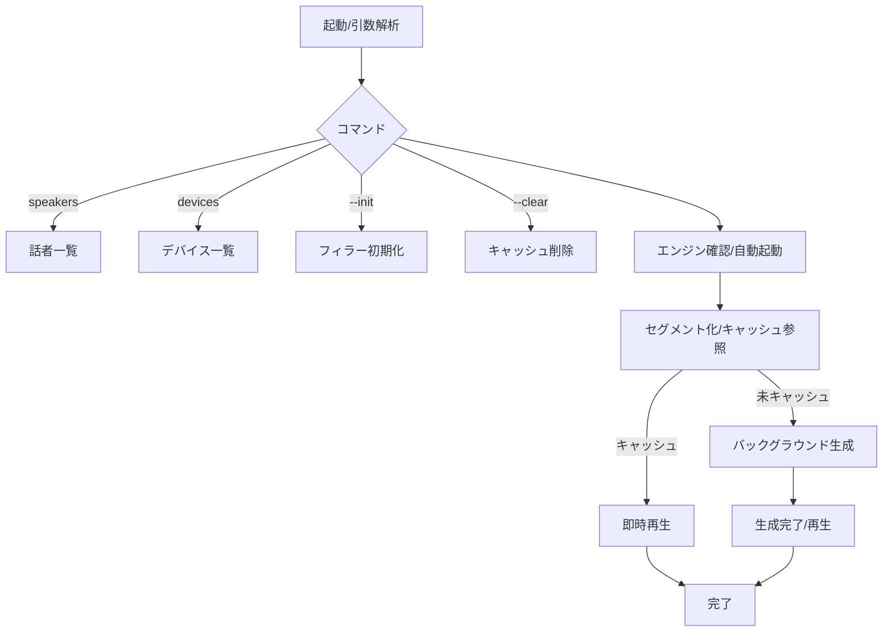

# VOICEVOX REST API ラッパー要件定義書（最終仕様）

## プロジェクト概要

- **タイトル**: VOICEVOX REST API ラッパーConsoleアプリ（インテリジェントキャッシュ付き）
- **概要**: VOICEVOX/AIVIS Speech を対象に、テキスト→音声変換・再生・キャッシュ・エンジン自動起動を行うWindows向けC#コンソールアプリ

## 実装サマリ

- **キャッシュ**: 文単位セグメント化 + MP3保存 + 期限/容量管理
- **再生**: NAudioベース、デバイス暖気運転（オプション）
- **エンジン管理**: 自動起動、起動完了待機、永続化（任意）
- **フィラー**: 生成待機時の自然な間つなぎ音声（任意）
- **CLI**: `speakers`/`devices`/`--init`/`--clear`、各種オプション
- **出力**: `--out` で WAV/MP3 保存、`--no-play` で再生抑止
- **ログ**: レベル/フォーマット切替、`--verbose` で詳細タイミング

## コマンド/オプション仕様

```bash
VoicevoxRunCached <text> [options]
VoicevoxRunCached speakers
VoicevoxRunCached devices [--full] [--json]
VoicevoxRunCached --init
VoicevoxRunCached --clear

Options:
  --speaker, -s <id>       話者ID (default: 1)
  --speed <value>          話速 (default: 1.0)
  --pitch <value>          音高 (default: 0.0)
  --volume <value>         音量 (default: 1.0)
  --no-cache               キャッシュを使用しない
  --cache-only             キャッシュのみ使用（API呼び出しなし）
  --out, -o <path>         出力ファイル（.wav/.mp3自動判定）
  --no-play                再生しない（`--out`と併用）
  --verbose                詳細タイミング表示（ログをDebug相当に）
  --log-level <level>      trace|debug|info|warn|error|crit|none
  --log-format <fmt>       simple|json
  --help, -h               ヘルプ表示
```

## 設定ファイル構造（`appsettings.json`）

```json
{
  "VoiceVox": {
    "EngineType": "VOICEVOX", // or "AivisSpeech"
    "BaseUrl": "http://127.0.0.1:50021",
    "EngineArguments": "--host 127.0.0.1 --port 50021",
    "DefaultSpeaker": 1,
    "EnginePath": "",
    "ConnectionTimeout": 30,
    "AutoStartEngine": true,
    "StartupTimeoutSeconds": 30,
    "KeepEngineRunning": true
  },
  "Cache": {
    "Directory": "./cache/audio/",
    "UseExecutableBaseDirectory": true,
    "ExpirationDays": 30,
    "MaxSizeGB": 1.0
  },
  "Audio": {
    "OutputDevice": -1,
    "Volume": 1.2,
    "PrepareDevice": false,
    "PreparationDurationMs": 200,
    "PreparationVolume": 0.01,
    "OutputDeviceId": ""
  },
  "Filler": {
    "Enabled": true,
    "Directory": "./cache/filler/",
    "UseExecutableBaseDirectory": true,
    "FillerTexts": [
      "えーっと、",
      "あのー、",
      "あのう、",
      "ええと、",
      "ええっと、",
      "えとえと、"
    ]
  },
  "Logging": {
    "Level": "Information",
    "Format": "simple"
  }
}
```

## 主要設計

- **セグメント化**: 句読点で文分割し、部分変更時もキャッシュを最大活用
- **キャッシュ形式**: MP3 + `.meta.json`（作成日時/テキスト/話者/各種パラメータ）
- **容量制御**: `MaxSizeGB` 超過時に古い順で削除、`ExpirationDays` で期限切れ自動削除
- **デバイス準備**: 初回音切れ対策として極小音量の事前再生（可変長）
- **エンジン自動起動**: パス未指定時は既知パス探索、起動完了まで `/version` で待機
- **AIVIS対応**: `EngineType` 切替、ポート/スピーカーIDの例示

## 依存関係

- `NAudio`, `NAudio.Lame`
- `Microsoft.Extensions.Configuration`
- `System.Text.Json`

## 簡易フロー



## トラブルシューティング要点

- エンジン未接続: BaseUrl確認、`AutoStartEngine` 利用、`EnginePath` 設定
- 音切れ: `Audio.PrepareDevice=true`、`PreparationDurationMs`/`PreparationVolume` 調整
- デバイス選択: `devices --full` で確認、`OutputDeviceId` 設定

## 移行メモ（初期仕様との差分）

- キャッシュ形式: WAV→MP3
- 追加コマンド: `devices`, `--init`, `--clear`
- 新オプション: `--out`, `--no-play`, `--log-level`, `--log-format`
- 新設定: `UseExecutableBaseDirectory`, `OutputDeviceId`, `Logging`, `EngineType`, `KeepEngineRunning`
